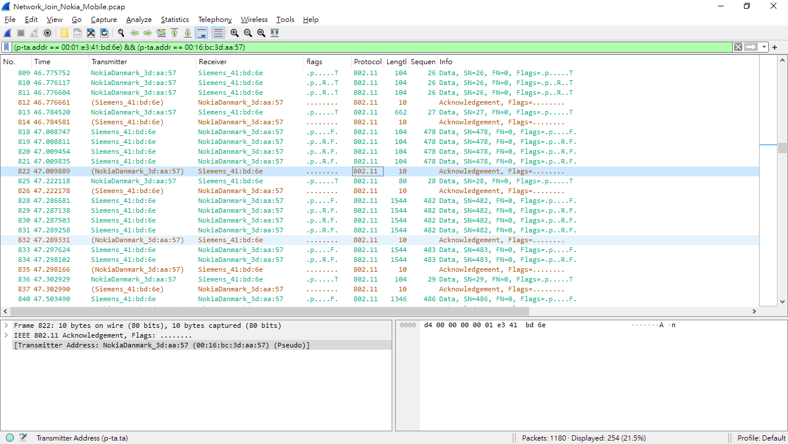

# wireshark_pseudo_ta
A lua plugin for Wireshark to show inferred/pseudo transmitter address for ACK, CTS, ..., with a single field for filtering ta&amp;ra.
Inspired by and Modified from [wireshark-tcpextend](https://github.com/gaddman/wireshark-tcpextend)

## About
Some protocols in 802.11 do not have transmitter fields, because sometimes we do not need it. However, it may sometimes cause annoying things while analyzing sniffer logs. For example, we may need to include ACK frames to know whether receiver has received a frame between traffics of STA1 & STA2. But since ACK frame does not have trasmitter address, we cannot simply use a display filter like `(wlan.addr == <STA1>) && (wlan.addr == <STA2>)`. When we include ACKs by extends the filter with `((wlan.ra == <STA1>) || (wlan.ra == <STA2>)) && (wlan.fc.type_subtype == 0x001d)`, all Acks that may not issue by STA1 or STA2 will be included.

The plugin will first check whether the `wlan.ta` field is exists. If exist, it will directly use the value as `p-ta.ta`. Otherwise, it will try to infer a pseudo transmitter address as `p-ta.ta`, when the transmitter of the previous frame is equal to the receiver of the current frame. It also provide an additional field that contains transmitter and receiver address. Thus, when we want to filter the traffic between STA1 & STA2 with ACKs included, we can write a much shorter filter `(p-ta.addr == <STA1>) && (p-ta.addr == <STA2>)`.

If there is any question or bug, please feel free to open issues!

## Functionality
1. Provide a pseudo transmitter address based on previous frame.
2. Provide a field to distinguish whether the address is pseudo.
3. Provide an additional field to combine transmitter and receiver address.

## Enable Condition
1. wlan.fc.type_subtype == 0x001d (ACK)
2. wlan.fc.type_subtype == 0x001c (RTS)

## How to use
Placed in [Wireshark Plugin Folder](https://www.wireshark.org/docs/wsug_html_chunked/ChPluginFolders.html) and restart Wireshark.

## Fields
| Field            | Type    | Meaning                                                                |
|------------------|---------|------------------------------------------------------------------------|
| p-ta.ta          | address | Transmitter Address                                                    |
| p-ta.taStr       | string  | String of Transmitter Address   with parentheses to indicate pseudo |
| p-ta.isPseudo    | bool    | Is Pseudo                                                              |
| p-ta.isPseudoStr | string  | String to indicate pseudo                                              |
| p-ta.addr        | address | TA & RA                                                                |

## Screenshot
Pcap (`Network_Join_Nokia_Mobile.pcap`) is from [Wireshark Wiki](https://wiki.wireshark.org/SampleCaptures#wifi-wireless-lan-captures-80211)
